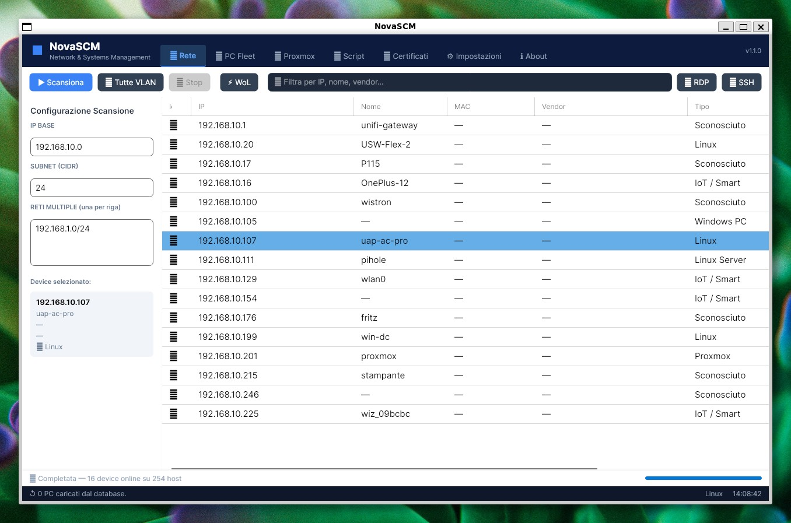
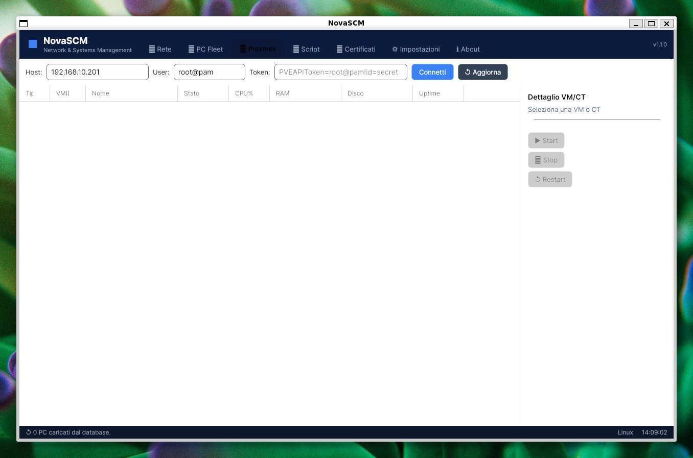
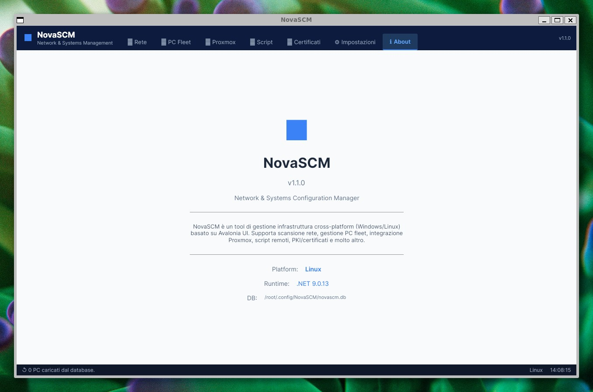

<p align="center">
  
</p>

<p align="center">
  <a href="../../../NovaSCM/blob/main/LICENSE"></a>
  
  
  
  
</p>

# NovaSCM — Linux Edition

Cross-platform port of [NovaSCM](https://github.com/ClaudioBecchis/NovaSCM) built with **Avalonia UI**.
Runs natively on **Linux and Windows** — same codebase, same features.

> ✅ **Tested and running on Linux** (WSL2 / Ubuntu, .NET 9.0.13)

---

## Screenshots (Linux)

<p align="center">
  
  
</p>
<p align="center">
  
</p>

---

## Features

- **Network Scanner** — ping sweep, hostname, device type detection
- **PC Fleet** — inventory, RDP/SSH one-click
- **Proxmox** — VM/CT management via REST API
- **Scripts** — remote script runner
- **Certificates** — WiFi EAP-TLS PKI management
- **Cross-platform** — Linux (X11/Wayland) + Windows

---

## Run on Linux

### Option 1 — Self-contained binary (no .NET required)

```bash
# Download and run
chmod +x NovaSCM
./NovaSCM
```

### Option 2 — Build from source

```bash
git clone https://github.com/ClaudioBecchis/NovaSCM-Linux
cd NovaSCM-Linux
dotnet publish -c Release -f net9.0 -r linux-x64 --self-contained true -p:PublishSingleFile=true -o ./publish
chmod +x ./publish/NovaSCM
./publish/NovaSCM
```

### Dependencies (Ubuntu/Debian)

```bash
sudo apt-get install -y libx11-6 libice6 libsm6 libfontconfig1 libgl1 libglib2.0-0
```

---

## Run on Windows

```bash
dotnet publish -c Release -f net9.0-windows -r win-x64 --self-contained true -p:PublishSingleFile=true -o ./publish
./publish/NovaSCM.exe
```

Or download the Windows installer from [NovaSCM Releases](https://github.com/ClaudioBecchis/NovaSCM/releases/latest).

---

## Architecture

| Component | Technology |
|-----------|-----------|
| UI Framework | Avalonia UI 11 |
| Runtime | .NET 9 |
| Database | SQLite (`~/.config/NovaSCM/novascm.db`) |
| Platform layer | `IPlatform` → `LinuxPlatform` / `WindowsPlatform` |

---

## License

MIT © 2026 Claudio Becchis — [PolarisCore.it](https://polariscore.it)
